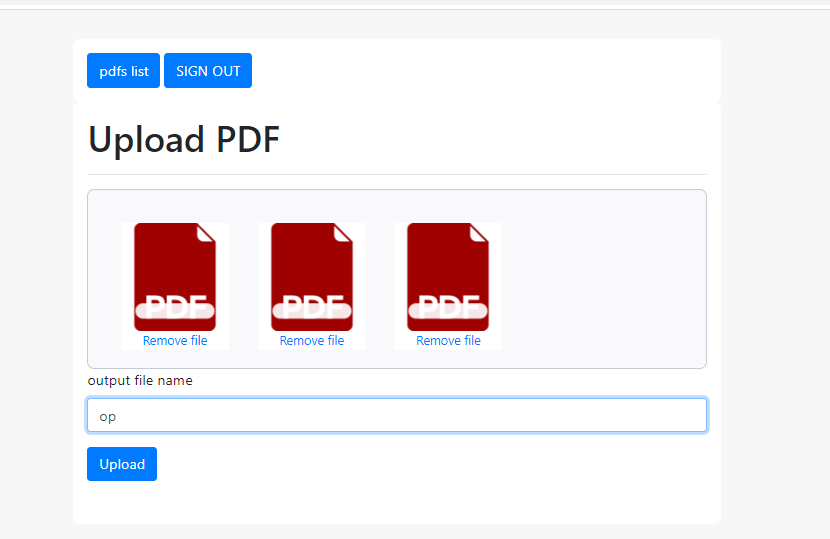
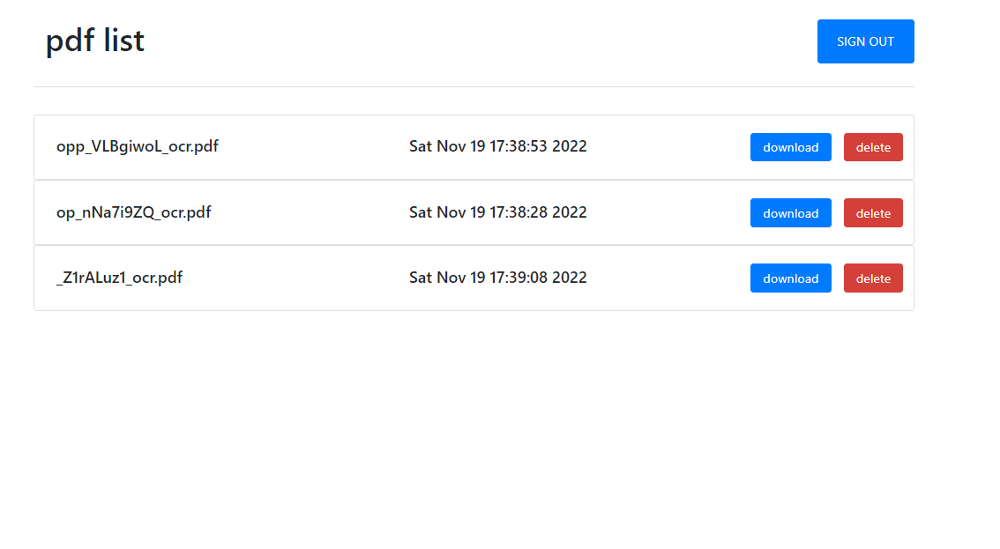

## The aim of the project
build a website to take multiple PDF files containing scanned pages as images.\
the page contains the barcode and number of barcodes we want to search for a specific number in that pdf(images).

## solution 
-grouping all pdfs in one pdf file  
-read use **pymudf** library to read pdf extract the image\
-focus on static art of image containing barcode and number  
-convert barcode to text using **pyzbar** and for some pages barcode is not clear we will use **pytesseract**(OCR) to convert the number in the image into text\
-write generated text on pdf page\
-save the pdf and send it 

## Notes
as I am dealing with too many pages around 500 pages in one pdf I used **Redis DB** and **rq-worker** to run tasks in the background to handle response time and use also **multiprocessor** to make the task run faster

#### backend coding 
    python, flask ,rq-worker
#### Frontend coding
    HTML, CSS, JavaScript, Ajax, Bootstrap
#### docker container 
    docrized the project for deploying it on herouku

### Login Page

### Home Page

### Pdf-list page

